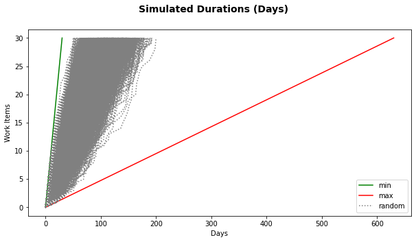
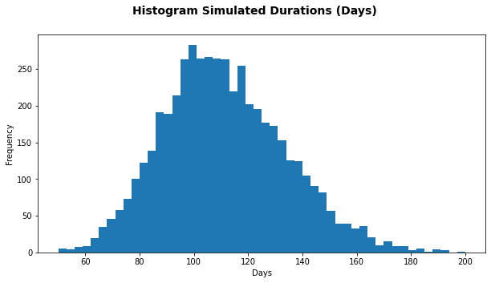

# Monte Carlo Simulation for Forecasting Cycle Times 

I came across some examples and plugins (see references) for estimating the cycle times in a Kanban system. 
So my goal was to build the same thing with a Python Jupyter Notebook. 

The parts:
- The Data Exploration Notebook ([notebooks/analyse_data.ipynb](notebooks/analyse_data.ipynb)) can be used to examine the data.
- The Forecasting Notebook ([notebooks/forecasting_with_monte_carlo.ipynb](notebooks/forecasting_with_monte_carlo.ipynb)) is used to do a 
Monte Carlo  simulation for the cycle times.
- The [data](notebooks/data.csv) as CSV file.
    - *id* => the JIRA issue id (only the number part).
    - *grp* => the project part from the JIRA issue as number
    - *cycle_time_days* => cycle time in days for this JIRA issue (`finish date - start date = cycle time days`).
    - *created_date* => when the issue was created





## Getting Started

All the required Python packages can be installed with `pipenv`.

### Project Setup

First you nee to install pipenv.

```bash
$ pip install --user pipenv
```

Install all the required packages

```bash
$ pipenv install --dev
```

### Run the Notebook

```bash
pipenv run jupyter-lab
```

## CI Build


## References

-	https://www.actionableagile.com/ 
-	https://kanbanize.com/blog/monte-carlo-simulations/ 
