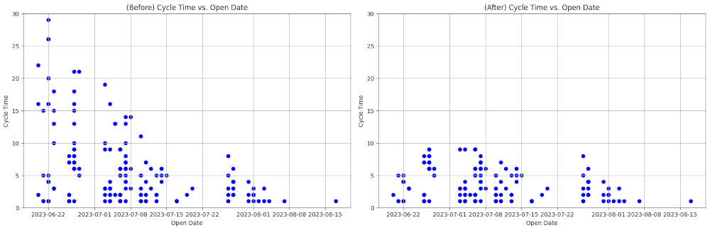
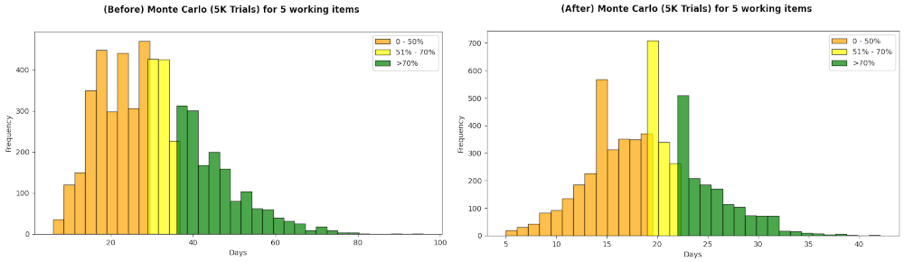

(find original README [here](./README.md), this one emphasizes different dataset)

There is already historical data taken from Jira (obfuscated) for bug item (likely to be fairly sized in nature). This is just a "what-if" we do things differently, that is by imposing supposedly-**"WIP-limit"**. To make it easier, we just remove items with long cycle time instead of examining historical WIP.

Here are the run chart comparison:



Below are the forecasts using Monte Carlo simulation 5k trials:



Before "what-if" imposing WIP-Limit, for 5 working items, 70% of the time they will be completed within 36 days, while after WIP-limit within 22 days, which is a better cycle time. 

```
np.quantile(simulated_total, q=[0.7])
```

This is just for the sake of argument, actual effort to impose WIP-Limit maybe harder maybe easier, plus it's just one aspect to Kanban. 
